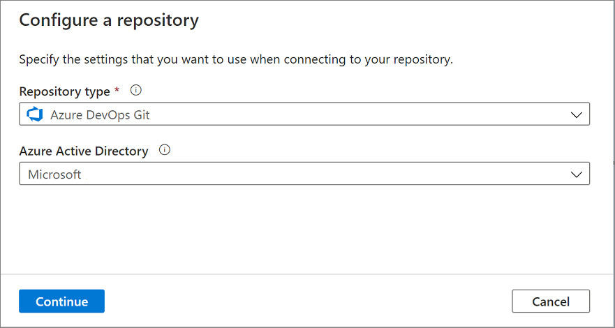
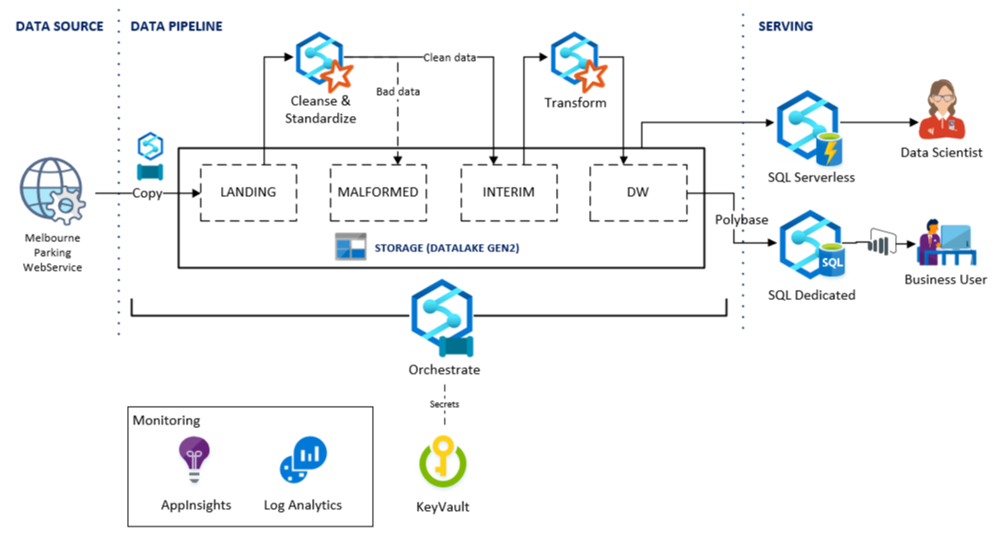

## **Hands on Lab for Modern DataWarehouse**

## **Overview** 
- This Lab is intended to do end to end Implementation of Modern Data Warehouse Solution using Azure DevOps
- Service Implementation can be reused for any MDW customer sceanarios
- Azure DevOps Pipelines are used for MDW Architecture Service Deployments 
- Sample Data Relevant for Synapse is uploaded as part of Implementation process to do Hands on Labs
- MDW Build and Release pipelines will replicate Dev Configuration to STG and Prod Environments
- Functionality testing is carried out with Integration Testing Pipeline

## **Solution Implementation Architecture**

## **Prerequiste for Installation**

1. **Azure DevOps Organization** with Permission to run Pipelines
2. **Azure Subscription** to create/host MDW services with **Owner role** on that subscription
3. Create **MDW Project** in Azure DevOps
4. Create **Azure DevOps Service principal from Azure DevOps Project Settings**
5. Provide your **Azure DevOps Service principal Owner permission** on Azure subscription
6. Provide your **Azure Login Account** and **Azure DevOps Service Principal - Storage Data Blob Contributor role** on your subscription
7. Create **service principal for Integration Testing**
8. Azure DevOps **Personal Token** for Azure DevOps related tasks

## **Post Installation Source Control Integration with Synapse**

## Prerequisites
Users must have the Azure Contributor (Azure RBAC) or higher role on the Synapse workspace to configure, edit settings and disconnect a Git repository with Synapse. 

## Login to Synapse Workspace with Minimum Contributor Access

## Connect with Azure DevOps Git 

### Azure DevOps Git repository settings

When connecting to your git repository, first select your repository type as Azure DevOps git, and then select one Azure AD tenant from the dropdown list, and click **Continue**.

The configuration pane shows the following Azure DevOps git settings:

| Setting | Description | Value |
|:--- |:--- |:--- |
| **Repository Type** | The type of the Azure Repos code repository.  | Azure DevOps Git |
| **Azure Active Directory** | Your Azure AD tenant name. | `<Directory Name>` |
| **Azure DevOps account** | Your Azure Repos organization name. You can locate your Azure Repos organization name at `https://dev.azure.com/<orgname>`. You can [sign in to your Azure Repos organization](https://dev.azure.com/) to access your Azure DevOps  | `<your organization name>` |
| **ProjectName** | Your Azure Repos project name. You can locate your Azure Repos project name at `https://dev.azure.com/<orgname>/<projectname>`. | `<your Azure Repos project name>` |
| **RepositoryName** | Your Azure Repos code repository name. Azure Repos projects contain Git repositories to manage your source code as your project grows. You can create a new repository or use an existing repository that's already in your project. | `<your Azure Repos code repository name>` |
| **Collaboration branch** | Your Azure Repos collaboration branch that is used for publishing. By default, its `master/main`. Change this setting in case you want to publish resources from another branch. You can select existing branches or create new | `master or main`Check your Reposistory |
| **Root folder** | Your root folder in your Azure Repos collaboration branch. | `/e2e_samples/parking_sensors_synapse/synapse/workspace` |
| **Import existing resources to repository** | Specifies whether to import existing resources from the Synapse Studio into an Azure Repos Git repository. Check the box to import your workspace resources (except pools) into the associated Azure DevOps in JSON format. This action exports each resource individually. When this box isn't checked, the existing resources aren't imported. | Checked (default) |
| **Import resource into this branch** | Select which branch the resources (sql script, notebook, spark job definition, dataset, dataflow etc.) are imported to. | Same as Collobaration branch master or main |

## **Post Installation MDW Pipeline Flow**

